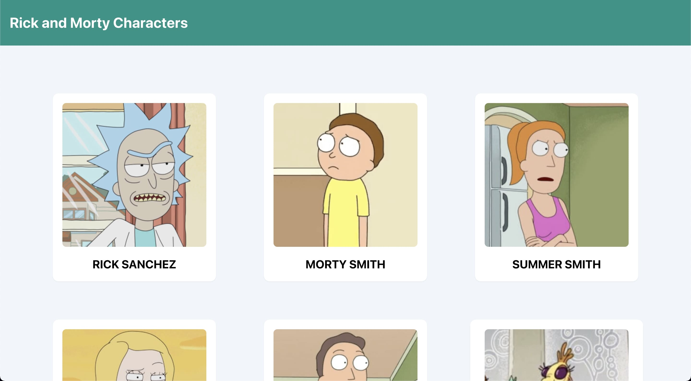
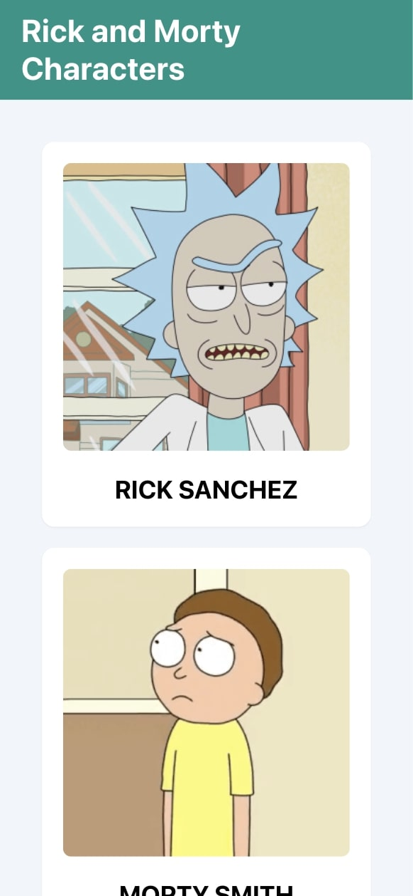
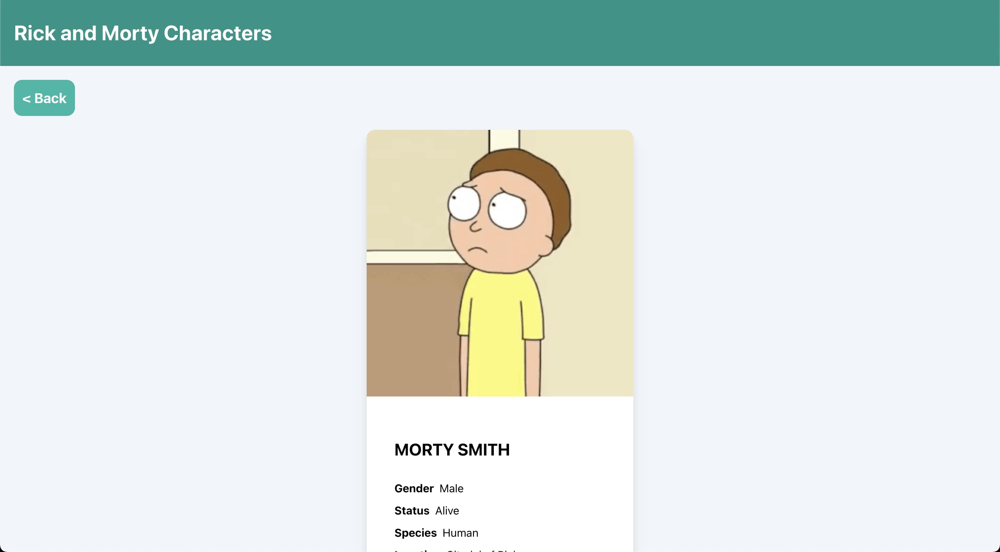
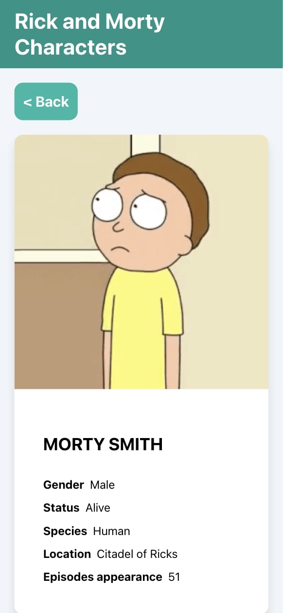

# Rick and Morty characters viewer app

---

## Run the app

In the project directory, you can run:

### `yarn start`

Runs the app in the development mode. 
Open [http://localhost:3000](http://localhost:3000) to view it in the browser.

## Screenshoots

### Characters grid

### Character detail

